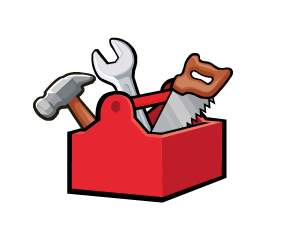

# Soko

A toolbox of cli tools for building and running javascript apps.



[Dan Abromov](https://github.com/gaearon) talked about his idea for "tool boxes"
in his talk [The Melting Pot of Javascript](https://www.youtube.com/watch?v=G39lKaONAlA)
which could bundle developers' tools together in an updatable package using the
most sensible defaults that would enable new users to hit the ground running
without getting tangled in a web of configuration. These are my tools.

These are certainly not exhaustive for every situation, but these are a set of
core tools I find myself reusing in each of my projects. This way, when I want
to update my version of babel, or use some new fangled compression algorithm, or
add new deployment methods, I can do that in one place and all my projects will
be updated.

## Install

`npm install soko --save-dev`

Install in your project locally to keep it in sync with how your project works.

## Usage

`npx soko <command>`

Soko can be installed in your project's local `node_modules` folder and run
using npm's new `npx` command (which will search in your `$PATH`, but also in
your local `node_modules/.bin` for any matching command).

`npx` is a tool that came out with [npm v5.2.0](https://github.com/npm/npm/releases/tag/v5.2.0)
"is meant to make it easy to use CLI tools and other executables hosted on the
registry".

This is how you [install node and update npm](https://docs.npmjs.com/getting-started/installing-node).

### Launch a NodeJS Server

`npx soko server /path/to/nodejs/app.js`

If there's a server already running, kill it.

### Watch for Changes

```
npx soko watch
  --cssIn /path/to/styles.scss
  --jsIn /path/to/app.js
  --assetsIn /path/to/assets/folder`
```

Watch source files for any changes and rebuild outputs if necessary.

### Start Development Environment

`npx soko dev /path/to/nodejs/app.js`

Build all front-end files, start server, watch source files for changes, and
restart server when they do.

### Build All Front-end Assets

You can also execute all build commands in one go.

```
npx soko build
  --cssIn /path/to/styles.scss
  --jsIn /path/to/app.js
  --assetsIn /path/to/assets/folder`
```

### Build React and/or ES2015+ Javascripts

`npx soko build:js /path/to/app.js`

Use Babel with the `env` preset to target specific environments (using
[browserlist](https://github.com/ai/browserslist) format) for output along
with Browserify to enable multi-file modules, then pass the results through
uglify to make it super small.

### Build SASS Styles

`npx soko build:css /path/to/styles.scss`

Compile SASS and minify CSS. Makes use of
[autoprefixer](https://github.com/postcss/autoprefixer), so you can just
write pure SASS/CSS.

### Build Assets

Simply copy static asset files to build folder to place them altogether beside
your scripts and styles. Static assets might also include HTML files ;)

`npx soko build:assets /path/to/assets/folder`

### Revisioning All Files

`npx soko rev`

Copy all static assets to build folder and rename them using a hash of their
contents such that the hash (and filename) will change if the contents change
thereby breaking any cacheing mechanisms automatically.

Using a manifest of all renamed files, update all references to those files
in any JS, CSS, or HTML files that need to load them.

### Revisioning Static Assets

`npx soko rev:assets`

### Revisioning JS

`npx soko rev:js`

### Revisionsing CSS

`npx soko rev:css`

### Revisioning HTML

`npx soko rev:html`

### Deploy Build to Remote

`npx soko deploy --host 100.200.111.222`

Use rsync to sync files in your build folder with a remote server and run any
necessary remote commands (e.g., `npm install` in nodejs folder to update its
dependencies and then restart the server).

## TODO

- always reduce the amount of configuration required
- add commands to build docker containers easily

## License

MIT
